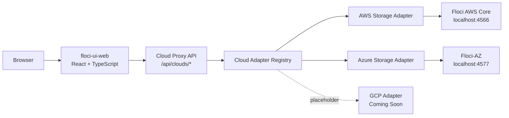
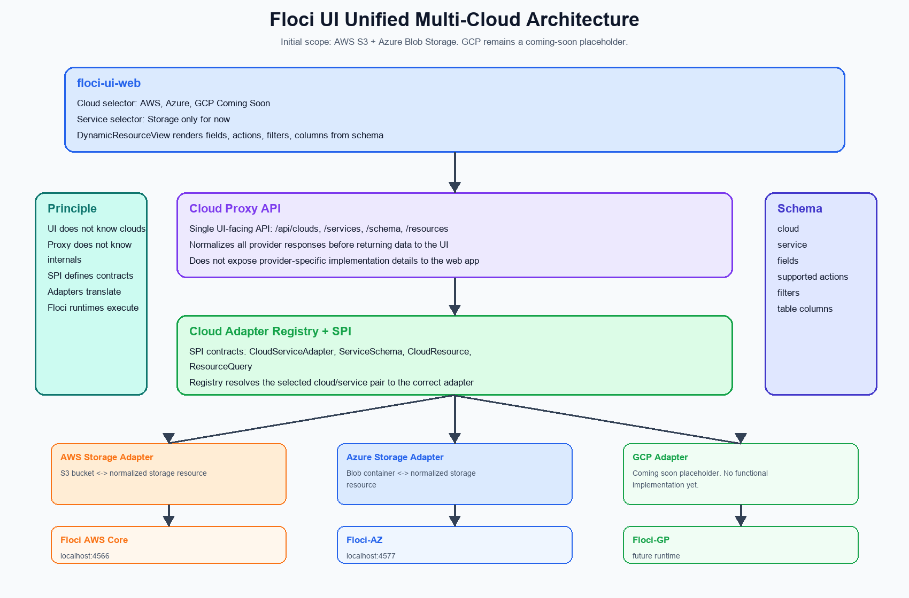

# Floci UI

Floci UI is evolving into a unified local-first multi-cloud runtime explorer for
[Floci](https://github.com/floci-io/floci) and compatible local cloud runtimes.

It is designed to feel familiar to AWS Console users while staying honest about the current implementation: the UI only
renders real data returned by Floci-compatible APIs. If a service or operation is not wired yet, the screen stays empty
or shows an explicit placeholder. No fake resources, demo rows, or mock service data are shown in normal mode.

## Why Floci UI?

Floci exposes cloud-compatible APIs that are ideal for SDKs, CLI scripts, and automated tests, but day-to-day local
development also needs a visual layer:

- See which local cloud runtime the UI is connected to.
- Browse real local cloud resources without leaving the browser.
- Inspect service state without inventing resources.
- Use CloudWatch logs and metrics as the telemetry surface.
- Keep unsupported screens explicit instead of hiding gaps behind dummy data.

## Project Vision

Floci UI is moving from an AWS-focused local console toward a metadata-driven explorer that can render multiple local
cloud runtimes through one consistent interface.

The initial unified scope is intentionally small:

- AWS S3 through Floci AWS Core.
- Azure Blob Storage through Floci-AZ.
- AWS Compute through the Cloud Explorer adapter model.
- AWS Networking through the Cloud Explorer adapter model.
- GCP appears only as a coming-soon placeholder.

Future scope:

- More AWS services.
- More Azure services.
- GCP support coming soon.
- Plugin/adapters ecosystem.
- Observability and resource inspection.

## Architecture Principle

The rule of the project is:

- The UI does not know clouds.
- The proxy does not know internal implementations.
- The SPI defines the contracts.
- The adapters perform the translation.
- Floci Core executes the runtime.



The unified UI talks only to the Cloud Proxy API. The proxy resolves the selected cloud and service through the adapter
registry, then returns normalized resources and metadata schemas back to the web app.

## Architecture



Short implementation notes are available in [docs/implementation-notes.md](docs/implementation-notes.md).

## Unified Storage Scope

The first metadata-driven service is `storage`.

| Cloud | Runtime | Adapter | Resource mapping | Status |
|---|---|---|---|---|
| AWS | Floci AWS Core | AWS Storage Adapter | S3 bucket -> storage resource | Implemented |
| Azure | Floci-AZ | Azure Storage Adapter | Blob container -> storage resource | Implemented |
| GCP | Future Floci-GP | GCP Adapter | Cloud Storage bucket -> storage resource | Coming soon |

Normalized resource shape:

```json
{
  "id": "string",
  "name": "string",
  "cloud": "aws | azure",
  "service": "storage",
  "type": "bucket | container",
  "region": "string | null",
  "createdAt": "string | null",
  "metadata": {}
}
```

## Unified Compute Scope

`compute` is available in the Cloud Explorer for AWS only.

| Cloud | Runtime | Adapter | Resource mapping | Status |
|---|---|---|---|---|
| AWS | Floci AWS Core | AWS Compute Adapter | EC2 instance / AMI -> compute resource | Partial |
| Azure | Future Floci-AZ compute adapter | Azure Compute Adapter | VM -> compute resource | Coming soon |
| GCP | Future Floci-GP compute adapter | GCP Compute Adapter | VM instance -> compute resource | Coming soon |

Current AWS Compute support in the unified Cloud Explorer:

- List EC2 instances as normalized compute resources.
- List AMIs as normalized compute resources.
- Inspect normalized instance and AMI metadata.
- Launch instances through an AWS-specific Compute panel.
- Start, stop, reboot, and terminate instances.
- View console output.
- Create AMIs from instances.
- Edit instance tags.
- Deregister AMIs.

Current limitations:

- Instance launch uses the Compute panel instead of the generic Cloud Explorer form because it needs dependent selectors
  such as VPC -> Subnet -> Security Group.
- There is no standalone legacy `/ec2` frontend page in the current UI.

## Unified Networking Scope

`networking` is available in the Cloud Explorer for AWS only.

| Cloud | Runtime | Adapter | Resource mapping | Status |
|---|---|---|---|---|
| AWS | Floci AWS Core | AWS Networking Adapter | VPC -> networking resource | Partial |
| Azure | Future Floci-AZ networking adapter | Azure Networking Adapter | VNet -> networking resource | Coming soon |
| GCP | Future Floci-GP networking adapter | GCP Networking Adapter | VPC network -> networking resource | Coming soon |

Current AWS Networking support in the unified Cloud Explorer:

- List VPCs as normalized networking resources.
- Inspect selected VPC metadata.
- Use the Networking panel for VPC, subnet, security group, gateway, route table, NAT gateway, and Elastic IP workflows.
- Create VPCs directly or through the VPC wizard.
- Allocate, associate, disassociate, and release Elastic IPs.

Current limitations:

- AWS Networking uses an AWS-specific panel because the workflows need resource-specific forms and nested operations.
- Azure VNet and GCP VPC adapters are not implemented yet.

## Current Cloud Service Status

These percentages describe UI coverage in the current frontend, grouped by the `Cloud Services` navigation model. They
do not describe backend completeness. A category can have a mature AWS-specific page while still being only partially
integrated into the unified Cloud Explorer model.

| Category | AWS | Azure | GCP | Current UI status |
|---|---:|---:|---:|---|
| Storage | 95% | 80% | Coming soon | Unified Cloud Explorer support for AWS S3 and Azure Blob Storage. Buckets/containers, object browsing, upload, download, delete, folder prefixes, metadata, and inspector are wired. AWS still has a richer legacy S3 page for bucket tags, object tags, versioning, copy, and bulk delete. |
| Compute | 70% | Coming soon | Coming soon | AWS Compute is available under `/cloud-explorer/aws/compute`. It lists EC2 instances and AMIs, exposes launch/lifecycle actions through the Compute panel, supports console output, tags, AMI creation, and terminate/start/stop/reboot flows. Azure and GCP compute adapters are placeholders. |
| Networking | 75% | Coming soon | Coming soon | AWS Networking is available under `/cloud-explorer/aws/networking`. The panel exposes VPCs, subnets, security groups, internet gateways, NAT gateways, route tables, elastic IPs, and a VPC wizard through EC2-backed APIs. Azure VNet and GCP VPC support are placeholders. |
| k8s Engine | 35% | Coming soon | Coming soon | AWS EKS can be listed and inspected through the Cloud Explorer adapter and the dedicated EKS page. Cluster creation and node group management are not yet surfaced. |
| Database | 45% | Coming soon | Coming soon | AWS database support focuses on RDS and DynamoDB. RDS is list/inspect oriented, while DynamoDB has a mature AWS-specific table/item UI. A normalized multi-cloud database model is still in progress. |
| Queue | 100% AWS legacy | Coming soon | Coming soon | AWS SQS has a mature AWS-specific page for queue lifecycle, messages, tags, settings, DLQ configuration, and redrive. It is not yet exposed as a unified Cloud Explorer `queue` service. |
| Function | 90% AWS legacy | Coming soon | Coming soon | AWS Lambda has a mature AWS-specific page for list, inspect, invoke, log tail, environment variables, and delete. It is not yet exposed as a unified Cloud Explorer `function/serverless` service in the frontend sidebar. |
| Events | 90% AWS legacy | Coming soon | Coming soon | AWS SNS has a mature AWS-specific page for topics, subscriptions, and publish. A normalized eventing category is not wired yet. |
| Observability | 90% AWS legacy | Coming soon | Coming soon | AWS CloudWatch has a mature AWS-specific page for logs, metrics list, alarms list, and Floci request ingestion. A normalized multi-cloud observability category is not wired yet. |
| Security / Identity | Placeholder | Placeholder | Placeholder | IAM, KMS, Secrets Manager, Cognito, and related services remain placeholders in the UI. |

Connected Cloud Explorer categories today:

- Storage: AWS S3, Azure Blob Storage.
- Compute: AWS EC2.
- Networking: AWS VPC/networking resources.
- k8s Engine: AWS EKS.
- Database: AWS RDS/DynamoDB-oriented support.

AWS-specific legacy pages still available today:

- CloudWatch
- S3
- SQS
- Lambda
- DynamoDB
- SNS
- EKS
- RDS

Placeholder or not-yet-normalized categories today:

- Azure Compute, Networking, k8s, Database, Queue, Function, Events, Observability.
- GCP all categories.
- IAM, KMS, Secrets Manager, Cognito, Systems Manager, ElastiCache.

## Category Detail

<details>
<summary><strong>Storage</strong></summary>

### Storage

Cloud Explorer support:

- AWS S3 bucket -> normalized storage resource.
- Azure Blob container -> normalized storage resource.
- GCP Cloud Storage is a placeholder.
- Shared resource table, resource inspector, runtime status, adapter status, and action capabilities.
- Object/blob browser with prefix navigation.
- Upload, download, delete, refresh, and folder-prefix creation.
- Azure folder markers are hidden and rendered as navigable folders.
- Size and last-modified metadata are normalized for AWS objects and Azure blobs when the runtime returns them.

AWS-specific S3 page still adds:

- Bucket tags.
- Object tags.
- Bucket versioning.
- Copy object.
- Bulk delete.
- Rich bucket/object lifecycle controls.

Remaining gaps:

| Gap | Notes |
|---|---|
| GCP Storage | Coming soon |
| Azure bucket/container advanced settings | Tags, access policy, and metadata editing are not yet exposed |
| Unified bulk actions | Multi-select and bulk delete are richer in the AWS S3 page than the Cloud Explorer storage view |
| Version browser | AWS versioning can be toggled in legacy S3, but object version browsing is not wired |

</details>

<details>
<summary><strong>Compute</strong></summary>

### Compute

AWS support:

- Entry point: `/cloud-explorer/aws/compute`.
- AWS Compute adapter registered through the Cloud Adapter Registry.
- Normalized EC2 instances and AMIs in the generic resource table.
- Compute panel for AWS-specific operations.
- Instance launch form with AMI, instance type, key pair, VPC/subnet/security group, IAM profile, and user data.
- Instance lifecycle actions: start, stop, reboot, terminate.
- Console output.
- Create AMI from instance.
- Inline instance tag editing.
- AMI deregistration.

Provider status:

| Provider | Status |
|---|---|
| AWS | Partial but usable |
| Azure | Coming soon |
| GCP | Coming soon |

Remaining gaps:

| Gap | Notes |
|---|---|
| Multi-cloud compute contract | AWS EC2 is wired; Azure VM and GCP Compute Engine adapters are not implemented |
| Generic create schema | EC2 launch needs dependent selectors, so it lives in the Compute panel rather than a flat generic form |
| Full parity with AWS console | Some lower-level EC2 actions remain pending |

</details>

<details>
<summary><strong>Networking</strong></summary>

### Networking

AWS support:

- Entry point: `/cloud-explorer/aws/networking`.
- AWS Networking adapter exposes VPCs as top-level normalized resources.
- Networking panel for VPC and EC2-networking-specific operations.
- VPC list, detail, create, delete, and VPC wizard.
- Subnets list, create, delete, and detail.
- Security groups list, create, delete, inbound rule editing, and outbound display.
- Internet gateways list, create, attach, detach, delete.
- NAT gateways list, create, delete.
- Route tables list, create, edit routes, subnet associations, delete.
- Elastic IPs list, allocate, associate, disassociate, release.

Provider status:

| Provider | Status |
|---|---|
| AWS | Partial but usable |
| Azure | Coming soon |
| GCP | Coming soon |

Remaining gaps:

| Gap | Notes |
|---|---|
| Multi-cloud networking contract | AWS VPC is wired; Azure VNet and GCP VPC are not implemented |
| Generic action schema | Many networking actions require resource-specific forms and are handled by the Networking panel |
| Advanced network features | Peering, endpoints, ACLs, and deeper routing workflows are not yet complete |

</details>

<details>
<summary><strong>k8s Engine</strong></summary>

### k8s Engine

AWS support:

- AWS EKS adapter exists for normalized Cloud Explorer list/inspect.
- Dedicated EKS page exists for AWS-focused cluster inspection.
- Cluster status, version, endpoint, VPC config, and node group information can be inspected when available.

Provider status:

| Provider | Status |
|---|---|
| AWS | List/inspect oriented |
| Azure | Coming soon |
| GCP | Coming soon |

Remaining gaps:

| Gap | Notes |
|---|---|
| Cluster creation | Not surfaced |
| Node group lifecycle | Not fully surfaced |
| Azure AKS / GCP GKE | Not implemented |

</details>

<details>
<summary><strong>Database</strong></summary>

### Database

AWS support:

- AWS Database adapter exists for normalized Cloud Explorer list/inspect.
- RDS page exists for AWS-focused database instance inspection.
- DynamoDB page exists as a mature AWS-specific table/item UI.
- DynamoDB supports table lifecycle, scan/query, create/edit/delete item, and typed value rendering.

Provider status:

| Provider | Status |
|---|---|
| AWS | RDS list/inspect plus mature DynamoDB legacy page |
| Azure | Coming soon |
| GCP | Coming soon |

Remaining gaps:

| Gap | Notes |
|---|---|
| Unified database resource model | RDS and DynamoDB have different shapes and are not fully normalized into one category yet |
| Azure database services | Not implemented |
| GCP database services | Not implemented |

</details>

<details>
<summary><strong>Queue, Function, Events, and Observability</strong></summary>

### Queue

AWS SQS has a mature AWS-specific page:

- Queue lifecycle.
- FIFO-aware send message.
- Batch send.
- Peek and delete messages.
- Queue tags.
- Editable queue configuration.
- Dead-letter queue configuration and redrive.

Known limitation:

| Feature | Status |
|---|---|
| Redrive task history | Floci core accepts `StartMessageMoveTask`, but `ListMessageMoveTasks` currently returns no results |
| Per-message visibility control | `ChangeMessageVisibility` is not surfaced |

### Function

AWS Lambda has a mature AWS-specific page:

- List and filter functions.
- Detail drawer.
- Runtime/state/configuration metadata.
- Environment variables.
- Invoke with JSON payload.
- Response display and log tail.
- Delete function.

Remaining gaps:

| Feature | Status |
|---|---|
| Create function | Not surfaced |
| Event source mappings | Not surfaced |
| Aliases and versions | Not surfaced |

### Events

AWS SNS has a mature AWS-specific page:

- Topic lifecycle.
- Standard and FIFO topic creation.
- Subscription list/manage.
- Publish message with optional subject.

Remaining gaps:

| Feature | Status |
|---|---|
| Topic attributes | Not fully surfaced |
| Topic tags | Not surfaced |
| Subscription filter policies | Not surfaced |

### Observability

AWS CloudWatch has a mature AWS-specific page:

- Log group lifecycle.
- Log stream browsing.
- Log event browsing and search.
- Floci request ingestion into `/floci/{service}` log groups.
- Metrics list.
- Alarms list.

Remaining gaps:

| Feature | Status |
|---|---|
| Metric graphing | Not surfaced |
| Alarm create/edit | Not surfaced |
| Manual `PutLogEvents` | Not surfaced |

</details>

<details>
<summary><strong>Security and Identity</strong></summary>

### Security and Identity

Current status:

- IAM is a placeholder.
- KMS is a placeholder.
- Secrets Manager is a placeholder.
- Cognito is a placeholder.
- Systems Manager is a placeholder.

These categories are intentionally visible so users can see the intended console shape, but they should not show fake
resources or demo data.

</details>

## Setup

### Prerequisites

- Node.js 20 or newer.
- pnpm 9 or newer.
- Bun, required by `packages/api`.
- Docker, if you want to run Floci with the published container image.

### 1. Start Floci core

Floci UI needs a running Floci core server before the API and frontend can load resources.

Terminal 1, using Docker:

```bash
docker run -d --name floci \
  -p 4566:4566 \
  -v /var/run/docker.sock:/var/run/docker.sock \
  -e FLOCI_DEFAULT_REGION=us-east-1 \
  -u root \
  floci/floci:latest
```

Terminal 1, or using a local clone of `floci-io/floci`:

```bash
git clone https://github.com/floci-io/floci.git ../floci
cd ../floci
./mvnw clean quarkus:dev
```

In both cases, verify Floci core is reachable:

```bash
curl http://localhost:4566/_floci/health
```

For Azure Blob Storage exploration, also run Floci-AZ and expose it at `FLOCI_AZURE_ENDPOINT`
(`http://localhost:4577` by default). Floci-AZ routes Blob Storage requests under an Azure account path;
the local default is `FLOCI_AZURE_ACCOUNT_NAME=devstoreaccount1`.

For local development, the UI needs all three of these components running:

1. Floci core on `http://localhost:4566`.
2. The Floci UI API backend on `http://localhost:3001` via `pnpm dev:api`.
3. The frontend dev server on `http://localhost:3000` via `pnpm dev`.

The frontend expects `/api/*` endpoints from `packages/api`, so running only `pnpm dev` is not enough.

### 2. Install Floci UI dependencies

```bash
pnpm install
```

### 3. Configure local environment

```bash
cp .env.example .env
```

Default `.env` values:

```bash
FLOCI_ENDPOINT=http://localhost:4566
FLOCI_AZURE_ENDPOINT=http://localhost:4577
FLOCI_AZURE_ACCOUNT_NAME=devstoreaccount1
VITE_MOCK_MODE=false
AWS_REGION=us-east-1
AWS_ACCESS_KEY_ID=test
AWS_SECRET_ACCESS_KEY=test
PORT=3001
```

`.env.example` already includes `VITE_MOCK_MODE=false` for real Floci usage.

### 4. Start the local API

Terminal 2:

```bash
pnpm dev:api
```

This starts `packages/api` on `http://localhost:3001` and points AWS SDK clients at `FLOCI_ENDPOINT`.

### 5. Start the frontend

Terminal 3:

```bash
pnpm dev
```

Open the UI:

```text
http://127.0.0.1:3000/
```

## Environment

```bash
FLOCI_ENDPOINT=http://localhost:4566
FLOCI_AZURE_ENDPOINT=http://localhost:4577
FLOCI_AZURE_ACCOUNT_NAME=devstoreaccount1
VITE_MOCK_MODE=false
AWS_REGION=us-east-1
AWS_ACCESS_KEY_ID=test
AWS_SECRET_ACCESS_KEY=test
PORT=3001
```

Floci credentials can be any non-empty value for local development. They are required because the AWS SDK expects
credentials, but Floci does not require real AWS credentials.

## Verification

```bash
pnpm lint
pnpm type-check
pnpm build
```

## Design Direction

The target experience is a practical AWS-console-style interface:

- Dense, service-oriented navigation.
- Clear connection state in the top bar.
- Real resource counts.
- Dedicated pages for high-usage services.
- Empty states when no resources exist.
- Placeholders when a service is not wired yet.
- No decorative data or fake operational metrics.

## Contributing

When adding service UI, follow these rules:

- Use existing Floci AWS-compatible endpoints.
- Do not add custom backend endpoints just for the UI unless the core project explicitly accepts that contract.
- Prefer real empty states over sample data.
- Keep service status percentages updated in this README.
- Add verification notes for any newly wired operations.

## License

This project follows the Floci ecosystem license.
